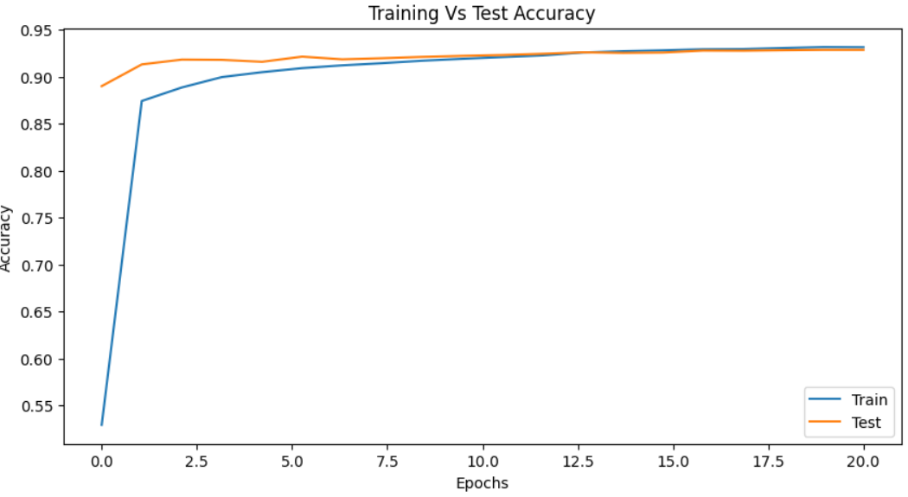
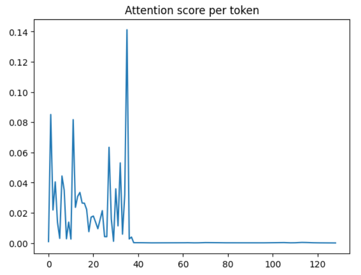

# 🚀 AG News Classification with a Nano Transformer  

A lightweight **Transformer-based** model for **news classification** using **PyTorch**.  
This project implements a **Nano Transformer**, a simplified Transformer model designed for efficiency, to classify news articles into four categories:  

- 🌍 **World**  
- ⚽ **Sports**  
- 💰 **Business**  
- 🔬 **Science/Technology**  

---

## 📂 Dataset  

The project uses the **AG News** dataset, a benchmark dataset for text classification. It contains **120,000** training samples and **7,600** test samples, each labeled into one of four categories.  

### 📥 Download the Dataset  

The dataset can be downloaded from **Kaggle**  

After downloading, place the dataset in the `data/` directory


---

## 🏗️ Model Architecture  

The **Nano Transformer** is a **compact encoder-only** Transformer designed for fast training while maintaining accuracy.  

### 🔧 Model Components:  

- **Token Embeddings** – Converts input text into dense vectors  
- **Sinusoidal Positional Embeddings** – Adds word order information  
- **Transformer Block**:  
  - **Multi-head self-attention (MHA)** – Captures contextual relationships  
  - **Feed-forward network (FFN)** – Learns high-level representations  
- **Final Linear Layer** – Maps the output to four news categories  

📌 *This small-scale Transformer model enables efficient training even on low-resource environments!*  

---

## 🏋️ Training and Evaluation

The model is trained using **PyTorch** with the following setup:  

- **Optimizer**: Adam  
- **Loss Function**: Cross-Entropy Loss  
- **Learning Rate Scheduler**: Cosine Annealing  
- **Regularization**: Token Dropping  

The model's performance is assessed using:  

- **Accuracy – Measures overall correctness**  
- **Precision & Recall – Evaluates classification performance per class**  
- **F1-Score – Balances precision and recall** 
- **Confusion Matrix – Visualizes classification errors**

## ⚡ How to Use

🔹 Clone the Repository

🔹 Install Dependencies:
```bash
pip install -r requirements.txt
```

🔹 Prepare Data:
Download the AG News dataset from Kaggle and place it in the data/ directory.

🔹 Run code


## 📊 Visualization


🔹 Training & Test Accuracy

  


🔹 Attention Scores per Token

  


## License

This project is licensed under the MIT License - see the LICENSE file for details.
This project is licensed under the MIT License - see the LICENSE file for details.
